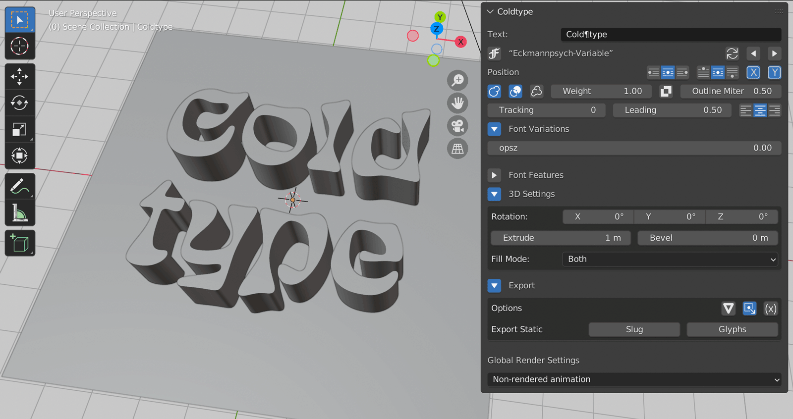

# Coldtype (for Blender)



### Installing

Using a Blender version 3.0 or later, grab the latest release from [the releases page](https://github.com/coldtype/coldtype-blender/releases), download the zip, then open Blender, open the Blender preferences, head to "Add-ons," then hit "Install..." in the top-bar and navigate to the Coldtype zip you download and hit "Install Add-on" — this should bring up Coldtype in the Add-ons view (if it doesn't, try searching for "Coldtype"); once you see it listed with a checkbox, enable the extension by hitting the checkbox.

__N.B.__ On Windows, the first time you use the Coldtype addon, you’ll need to run Blender as administrator (i.e. right-click and Run as Administrator).

### Development

Make a file `config.py` at the root of this directory, with one line setting a `BLENDER` variable to the specific Blender app/version you'd like to use for development, i.e.:

```python
BLENDER = "~/Desktop/Blenders/Blender3.2.1.app"
```

Then you can run the install script:

`python3.10 scripts/install.py`

That should place a symlink to `Coldtype` in the correct addons folder.